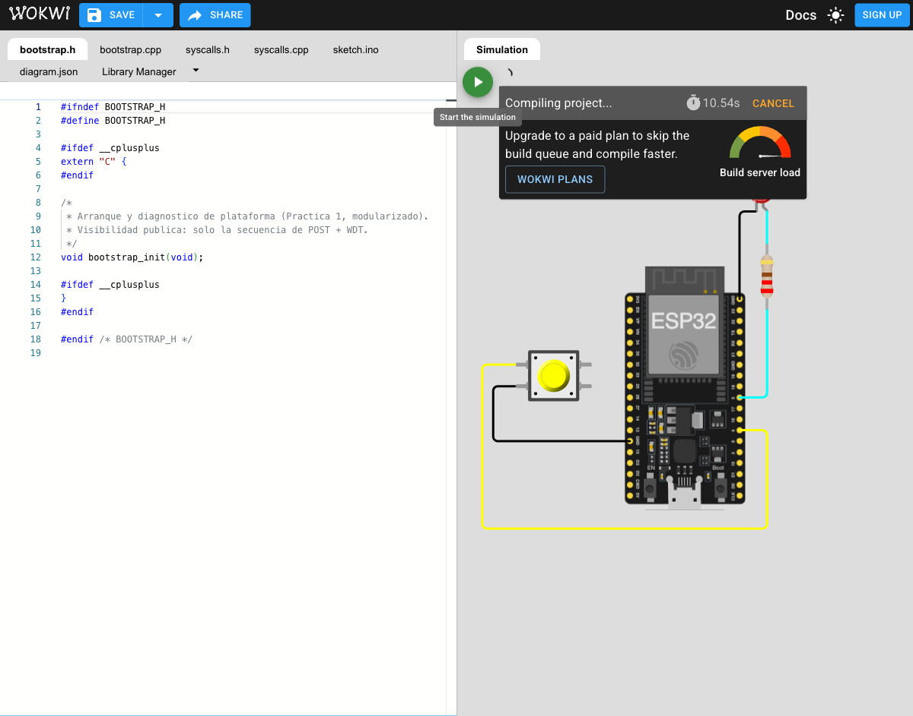
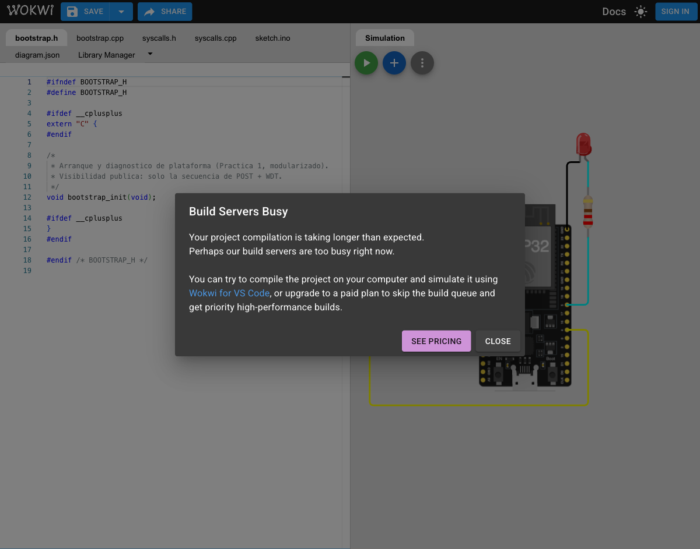
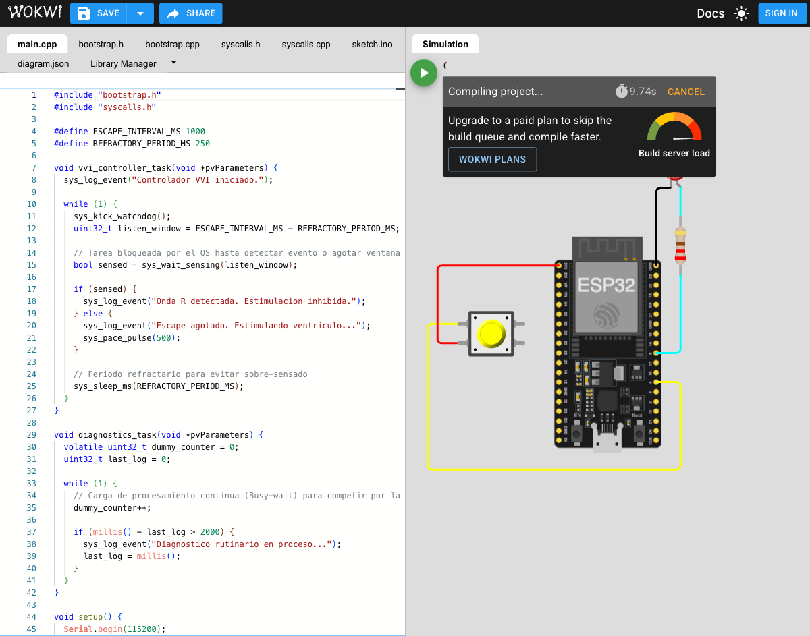
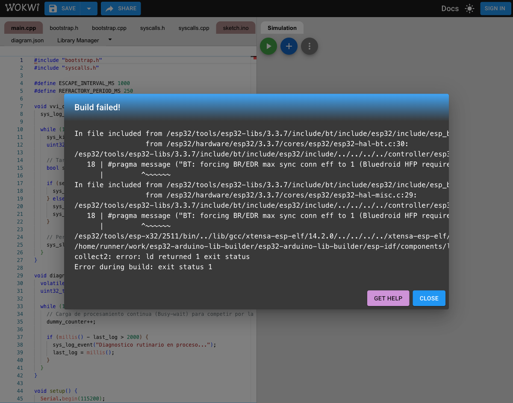
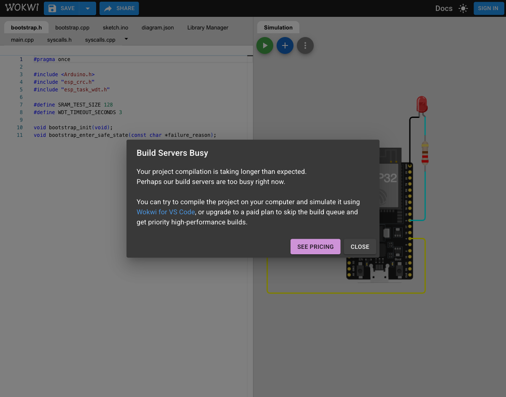

# Validación en Wokwi

Fecha local: 23 de septiembre de 2026. Simulador: proyecto ESP32 nuevo de Wokwi.

## Práctica 2

Se cargaron los seis archivos fuente y el circuito. El navegador mostró el ESP32, el botón de sensado en GPIO 4 y el LED de estimulación en GPIO 5. Los intentos de compilación terminaron con el diálogo **Build Servers Busy** antes de iniciar la simulación. Después se renombró `sys_init` a `vvi_sys_init` en el código fuente para evitar la colisión descubierta en Práctica 3; la versión final de Práctica 2 no alcanzó una compilación en Wokwi. No hubo salida serie ni comportamiento del LED que pudiera medirse.

## Práctica 3

Se cargaron los siete archivos fuente y el circuito. Un primer intento llegó al enlazador del Arduino ESP32 core 3.3.7 y falló por la colisión del símbolo global `sys_init` con lwIP (`multiple definition of sys_init`). Se cambió la API de inicio a `vvi_sys_init` en ambas prácticas. Dos intentos con los archivos corregidos terminaron en **Build Servers Busy** antes de devolver un resultado de compilación. No hubo salida serie ni medición de latencia.

## Alcance pendiente

Los escenarios clínicos de Práctica 2 y la respuesta a la onda R de Práctica 3 son **resultados esperados** en los reportes, no resultados observados. Queda pendiente repetir la simulación cuando el servicio de compilación responda, guardar trazas del monitor serie, probar el botón y medir la latencia. El objetivo de 120 µs requiere además medición de peor caso en hardware físico. La autoevaluación es personal y debe completarla cada integrante.
