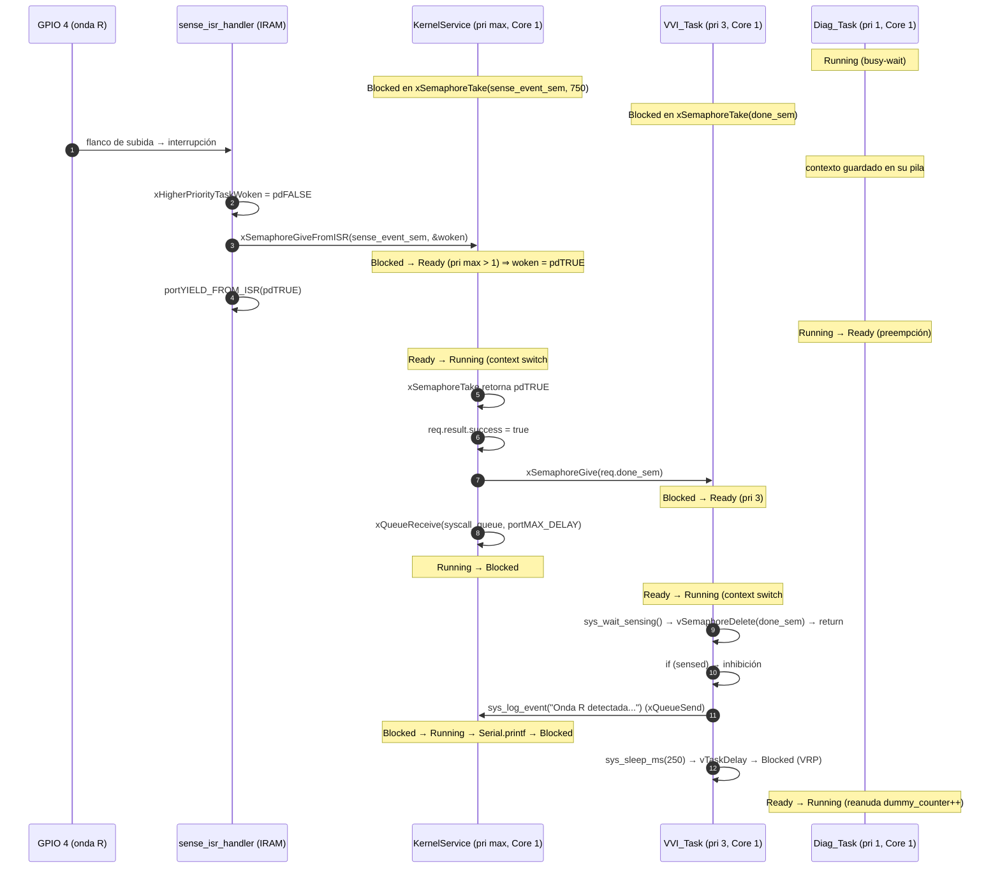
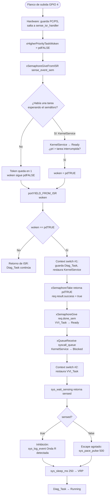

# Práctica 3 — Context Switch (marcapasos VVI)

Mecanismos de concurrencia y planificación apropiativa en FreeRTOS sobre ESP32. Tres tareas fijadas al Core 1 compiten por la CPU: `KernelService` (prioridad máxima), `VVI_Task` (prioridad 3) y `Diag_Task` (prioridad 1, busy-wait). La onda R llega como interrupción en GPIO 4 y debe expulsar a la tarea de diagnóstico en menos de 120 µs.

## Cómo ejecutar

### Wokwi

1. Abrir [un proyecto ESP32 nuevo](https://wokwi.com/projects/new/esp32).
2. Pegar `diagram.json` y subir `sketch.ino`, `main.cpp`, `bootstrap.h`, `bootstrap.cpp`, `syscalls.h`, `syscalls.cpp`.
3. Iniciar la simulación (monitor serie a 115200).

| Pin | Rol | Hardware Wokwi |
|---|---|---|
| GPIO 4 | Sensado ventricular (onda R), `INPUT_PULLDOWN`, flanco de **subida** | Botón amarillo a **3V3** |
| GPIO 5 | Pulso de estimulación (500 µs) | LED rojo + 220 Ω a GND |

### Salida esperada

```
[KERNEL LOG @ 1023456us] Controlador VVI iniciado.
[KERNEL LOG @ 1774012us] Escape agotado. Estimulando ventriculo...
[KERNEL LOG @ 2775103us] Escape agotado. Estimulando ventriculo...
[KERNEL LOG @ 3025871us] Diagnostico rutinario en proceso...
...
```

Sin pulsar el botón: un escape cada ~1000 ms (750 ms de escucha + 250 ms de VRP). `Diag_Task` imprime cada ~2 s aunque esté corriendo en busy-wait, porque `VVI_Task` y `KernelService` la expulsan cuando lo necesitan.

---

## 2. Investigación previa

### 1. Mecanismo de conmutación de contexto

Un *context switch* es el reemplazo de la tarea que ocupa el procesador por otra, de forma que la primera pueda reanudarse más tarde exactamente donde quedó. A nivel de CPU ocurre en tres pasos:

1. **Entrada.** Una interrupción (tick, GPIO) o una llamada explícita (`taskYIELD`, un `vTaskDelay`, bloquearse en una cola) transfiere el control al kernel. El hardware ya ha guardado el `PC` y el registro de estado en registros especiales (`EPC`/`EPS` en Xtensa).
2. **Guardar contexto.** El kernel apila en la **pila de la tarea saliente** todo lo que la CPU necesita para reanudarla: el *Program Counter*, el *Processor Status* (flags, nivel de interrupción, ventana de registros), los registros de propósito general (`a0`–`a15` en el Xtensa LX6, incluyendo el puntero de pila `a1`), registros auxiliares (`SAR`, contadores de lazo `LBEG/LEND/LCOUNT`) y, de forma perezosa, el estado del coprocesador de punto flotante. Después escribe el nuevo tope de pila en el `pxTopOfStack` del TCB de esa tarea.
3. **Elegir y restaurar.** `vTaskSwitchContext()` escoge la tarea Ready de mayor prioridad y actualiza `pxCurrentTCB`. El kernel carga `pxTopOfStack` del TCB elegido en `SP`, desapila los registros en orden inverso y ejecuta un retorno de interrupción (`rfi`/`rfe`) que salta al `PC` guardado. La nueva tarea no “sabe” que fue interrumpida.

El contexto **vive en la pila propia de cada tarea** (el *stack frame* de interrupción); el TCB solo guarda el puntero a ese marco. Por eso cada tarea recibe su propia pila en `xTaskCreate` y por eso un desbordamiento de pila corrompe el contexto guardado.

### 2. Bloque de Control de Tarea (TCB)

El `tskTCB` es la ficha con la que el kernel identifica y administra una tarea. Sus campos más relevantes:

| Campo | Uso |
|---|---|
| `pxTopOfStack` | Puntero al último contexto guardado (lo primero que lee la restauración) |
| `pxStack` / `pxEndOfStack` | Límites de la pila (detección de overflow) |
| `uxPriority` / `uxBasePriority` | Prioridad actual y prioridad base (herencia por mutex) |
| `xStateListItem` | Nodo con el que la tarea cuelga de una lista de estado (Ready, Delayed, Suspended) |
| `xEventListItem` | Nodo con el que cuelga de la lista de espera de una cola o semáforo |
| `pcTaskName`, `uxTCBNumber` | Identificación y trazas |
| `xCoreID` (ESP-IDF) | Afinidad: 0, 1 o `tskNO_AFFINITY` |

El planificador no recorre tareas: recorre **listas** de TCB.

- **Ready:** `pxReadyTasksLists[prioridad]`, un arreglo de listas. `uxTopReadyPriority` es un bitmap que indica la lista no vacía de mayor prioridad; `vTaskSwitchContext` toma el primer TCB de esa lista en O(1).
- **Running:** el TCB apuntado por `pxCurrentTCB[core]`. En SMP hay uno por núcleo.
- **Blocked:** el TCB se mueve a `pxDelayedTaskList` (ordenada por tick de vencimiento) y, si espera un objeto, además su `xEventListItem` se inserta en `xTasksWaitingToReceive`/`xTasksWaitingToSend` de ese objeto. Cuando ocurre el evento o el tick alcanza el vencimiento, el kernel lo saca de ambas listas y lo reinserta en la lista Ready de su prioridad; si esa prioridad supera a la de la tarea en ejecución, pide un cambio de contexto.

### 3. Planificación apropiativa y tick de sistema

- **Cooperativa** (`configUSE_PREEMPTION = 0`): una tarea conserva la CPU hasta que voluntariamente se bloquea o llama a `taskYIELD()`. Simple, sin carreras entre tareas, pero una tarea que no ceda puede matar el determinismo.
- **Apropiativa** (`configUSE_PREEMPTION = 1`, nuestro caso): el kernel expulsa a la tarea en ejecución **en el instante** en que otra de mayor prioridad pasa a Ready, ya sea por una ISR (`portYIELD_FROM_ISR`), por una API que despierta a otra tarea (`xQueueSend`, `xSemaphoreGive`) o por el tick.

El **tick** es la interrupción periódica del temporizador del sistema (en ESP32 el *CCOMPARE* de Xtensa o el *systimer* en IDF 5). En cada tick, `xTaskIncrementTick()`:

1. incrementa `xTickCount`;
2. revisa `pxDelayedTaskList` y pasa a Ready toda tarea cuyo tiempo de bloqueo expiró (así vence `vTaskDelay` o el timeout de `xSemaphoreTake`);
3. si hay *time slicing* y otra tarea de la **misma** prioridad está Ready, solicita un cambio de contexto (round-robin).

`configTICK_RATE_HZ` fija la resolución temporal: Arduino-ESP32 usa **1000 Hz (1 ms)**; ESP-IDF puro por defecto 100 Hz (10 ms). Todo retardo se cuantiza a ticks (`pdMS_TO_TICKS`), así que `sys_sleep_ms(250)` son 250 ticks y un `vTaskDelay(1)` puede durar entre 0 y 1 ms según la fase. Importante: la preempción por **interrupción externa** no espera al tick; el tick solo gobierna los vencimientos por tiempo.

### 4. Sobrecarga y latencia de interrupción

- **Overhead de conmutación de contexto:** tiempo que la CPU dedica a guardar el contexto, ejecutar el planificador y restaurar el otro contexto. Es trabajo del kernel que no avanza ninguna tarea. En un ESP32 a 240 MHz son unos cientos de ciclos, del orden de **1–3 µs** por conmutación.
- **Latencia de interrupción (ISR latency):** tiempo desde que el pin cambia hasta que se ejecuta la primera instrucción del manejador. La alargan: las secciones críticas del kernel con interrupciones enmascaradas (`portENTER_CRITICAL`), otras ISR de mayor nivel, fallos de caché si el manejador no está en `IRAM_ATTR`, y la propia latencia del pipeline.

Son cosas distintas: la ISR puede correr rápido y, aun así, la **tarea** que debe reaccionar tardar mucho si nadie pide el cambio de contexto (ver pregunta 2 de la sección 4.3). La *latencia de respuesta* total = latencia ISR + ISR + overhead de conmutación (una o varias).

En un marcapasos hay que acotar el **peor caso** y no el promedio, porque:

- una onda R detectada tarde puede procesarse **después** de que el kernel decidió estimular, produciendo un pulso sobre un ventrículo que ya se despolarizó (estimulación en la onda T, riesgo de arritmia);
- la ventana de escucha y el VRP se calculan asumiendo tiempos fijos; un *jitter* grande equivale a mover esas ventanas sin control;
- las certificaciones de dispositivos de soporte vital exigen demostrar un WCET (*worst-case execution time*), no una media. Por eso el caso de estudio fija 120 µs como límite duro.

### 5. Afinidad de núcleo (core pinning) en SMP

El ESP32 tiene dos núcleos Xtensa (PRO_CPU = Core 0, APP_CPU = Core 1). ESP-IDF trae un FreeRTOS **SMP**: hay un `pxCurrentTCB` por núcleo, cada núcleo corre su propio `vTaskSwitchContext` y su propio tick, y las listas Ready son **compartidas** y protegidas con spinlocks (`portMUX`). Al planificar, cada núcleo solo considera tareas cuyo `xCoreID` sea el suyo o `tskNO_AFFINITY`. Si una tarea Ready pertenece al otro núcleo, el kernel le envía una **interrupción inter-procesador** (IPI, `esp_crosscore_int_send_yield`) para que ese núcleo replanifique.

`xTaskCreatePinnedToCore(..., 1)` frente a `tskNO_AFFINITY`:

| | Fijada al Core 1 | Balanceo dinámico |
|---|---|---|
| Determinismo | Alto: siempre el mismo núcleo, misma caché, sin migraciones | Menor: la tarea puede correr en cualquier núcleo y su latencia depende de qué haga el otro |
| Latencia de despertar | Si la ISR también está en el Core 1 (nuestro caso: `attachInterrupt` se llama desde `setup()`, que corre en el Core 1), el cambio es local; sin IPI | Si la tarea despierta en el núcleo contrario a la ISR hay que pagar la IPI (µs extra) |
| Interferencia | Aislada de WiFi/BT y del sistema, que viven en el Core 0 | Puede compartir núcleo con pilas de red |
| Uso de CPU | Si el Core 1 está ocupado por una tarea de igual/mayor prioridad, no puede aprovechar el Core 0 libre | Mejor utilización |
| Concurrencia | Las tareas del mismo núcleo con prioridades distintas nunca corren a la vez → menos carreras | Dos tareas pueden ejecutarse **simultáneamente**; todo dato compartido necesita spinlock/mutex real |

Para la tarea médica se prefiere fijarla: se sacrifica utilización a cambio de un WCET acotado. La práctica va más lejos y fija **todas** las tareas al Core 1 para forzar la contienda y poder observar la preempción.

---

## 4.1 Análisis de requerimientos y extracción de restricciones

Clasificación del mensaje de la Dirección de Sistemas Clínicos. **Amarillo = requerimiento funcional (F)**, qué hace el código. **Verde = no funcional / restricción (NF)**, bajo qué límites opera.

| # | Fragmento del mensaje | Color | Tipo | Justificación |
|---|---|---|---|---|
| 1a | “garantizar que la tarea de control médico (`vvi_controller_task`) posea una prioridad estrictamente superior a cualquier otra tarea de procesamiento secundario o telemetría” | Verde | NF | Restricción de arquitectura: prioridad relativa. En el código: `VVI_Task` = 3, `Diag_Task` = 1 |
| 1b | “permitiendo la expulsión inmediata de la CPU ante estímulos cardíacos” | Amarillo | F | Comportamiento observable: al llegar una onda R el sistema debe hacer un cambio de contexto (`portYIELD_FROM_ISR`) |
| 2a | “El ciclo base del marcapasos opera a 60 ppm con un intervalo de escape de 1000 ms” | Amarillo | F | Acción: si no hay latido en 1000 ms, estimular. `ESCAPE_INTERVAL_MS` |
| 2b | “y un periodo refractario ventricular (VRP) de 250 ms” | Amarillo | F | Acción: ignorar sensado 250 ms tras cada evento. `sys_sleep_ms(REFRACTORY_PERIOD_MS)` |
| 2c | “La latencia total de respuesta del sistema desde que se genera una interrupción por sensado hasta que la tarea médica procesa la inhibición no debe exceder los 120 µs” | Verde | NF | Límite temporal duro (rendimiento). No describe qué hacer, sino en cuánto tiempo |
| 3a | “La tarea crítica de control médico debe ejecutarse de manera exclusiva en un núcleo dedicado del microcontrolador (Core 1)” | Verde | NF | Restricción de arquitectura/afinidad. `xTaskCreatePinnedToCore(..., 1)` |
| 3b | “los procesos de diagnóstico o soporte secundario deben aislarse para evitar interferencias de temporización” | Verde | NF | Restricción de aislamiento; condiciona dónde y con qué prioridad corre `Diag_Task` |
| 4a | “Las ISR asociadas al pin de sensado deben limitar estrictamente su labor al intercambio de semáforos o banderas” | Amarillo + Verde | F + NF | La acción (liberar `sense_event_sem`) es funcional; el “limitar estrictamente” es una restricción de diseño/seguridad sobre lo que **no** puede hacer la ISR |
| 4b | “delegando el procesamiento pesado al planificador mediante llamadas de cambio de contexto explícitas” | Amarillo | F | Acción concreta del código: la ISR debe invocar `portYIELD_FROM_ISR` |

Resumen: los funcionales definen el algoritmo VVI (escape, VRP, inhibición, señalización desde ISR); los no funcionales definen el contrato de tiempo real (120 µs, prioridades, Core 1, ISR mínima). Un funcional se verifica con una prueba de comportamiento; un no funcional se verifica **midiendo**.

---

## 4.2 Simulación manual del planificador

Modelo de los ejercicios: un solo núcleo (Core 1), `kernel_task` (pri 4), `vvi_task` (pri 3), `diag_task` (pri 1). En cada instante corre la tarea Ready de mayor prioridad; una tarea Running solo deja la CPU si se bloquea o si otra de mayor prioridad pasa a Ready.

### Ejercicio 1 — Detección asíncrona (t = 200 ms)

Condición inicial: `diag_task` Running; `vvi_task` y `kernel_task` Blocked. Evento: flanco de subida en GPIO 4 → ISR → `xSemaphoreGiveFromISR(sense_event_sem, &woken)` → `portYIELD_FROM_ISR(woken)`.

| Tarea | Estado previo | Estado final | Justificación / mecanismo de OS |
|---|---|---|---|
| `vvi_task` (Pri 3) | Blocked | **Running** | Estaba en la lista de espera de `sense_event_sem` (`xTasksWaitingToReceive`). `xSemaphoreGiveFromISR` la saca de esa lista y de la lista de retardo y la inserta en `pxReadyTasksLists[3]`. Como 3 > 1 (prioridad de la tarea interrumpida), la API escribe `woken = pdTRUE`; `portYIELD_FROM_ISR(pdTRUE)` marca el cambio de contexto pendiente y, al salir de la ISR, el kernel restaura el contexto de `vvi_task` en lugar del de `diag_task`. No espera al siguiente tick. |
| `diag_task` (Pri 1) | Running | **Ready** | Sufre preempción. Su contexto (PC, registros, SP) quedó guardado en su pila al entrar la ISR y ya no se restaura; su TCB permanece en `pxReadyTasksLists[1]`. No está Blocked porque no espera ningún evento: volverá a correr en cuanto ninguna tarea de mayor prioridad esté Ready. |
| `kernel_task` (Pri 4) | Blocked | Blocked | Nadie escribió en `syscall_queue`; sigue colgada de la lista de espera de la cola. |

> Nota sobre el código real. En `syscalls.cpp` la tarea que espera `sense_event_sem` **no** es `vvi_task` sino `kernel_service_task` (caso `SYS_WAIT_SENSING`), mientras `vvi_task` espera en `done_sem`. La cadena real es ISR → `kernel_task` (pri máxima) → `xSemaphoreGive(done_sem)` → `vvi_task`. Son **dos** conmutaciones en vez de una, pero el resultado observable es el mismo: `diag_task` es expulsada y `vvi_task` termina en Running. Ver el diagrama de la sección 4.3.

### Ejercicio 2 — Entrada en periodo refractario (t = 201 ms)

Condición inicial: `vvi_task` Running, acaba de llamar a `sys_sleep_ms(250)` → `vTaskDelay(pdMS_TO_TICKS(250))`. `diag_task` Ready. `kernel_task` Blocked.

| Tarea | Estado previo | Estado final | Justificación / mecanismo de OS |
|---|---|---|---|
| `vvi_task` (Pri 3) | Running | **Blocked** | `vTaskDelay` calcula el tick de despertar (`xTickCount + 250`), saca al TCB de `pxReadyTasksLists[3]` y lo inserta en `pxDelayedTaskList` ordenado por vencimiento (`prvAddCurrentTaskToDelayedList`). Luego fuerza `portYIELD_WITHIN_API()`: la tarea cede la CPU voluntariamente y guarda su contexto. Solo el tick 250 ms después la regresará a Ready; durante el VRP ningún flanco en GPIO 4 la despierta. |
| `diag_task` (Pri 1) | Ready | **Running** | Al recorrer `uxTopReadyPriority` la única lista no vacía es la de prioridad 1 (`kernel_task` sigue Blocked). El planificador carga `pxTopOfStack` de `diag_task`, restaura los registros que guardó en el ejercicio 1 y la tarea continúa **en la misma instrucción** de `dummy_counter++` donde fue expulsada. |
| `kernel_task` (Pri 4) | Blocked | Blocked | Sin peticiones en la cola. |

Observación: `sys_sleep_ms` es la única “syscall” que no pasa por `syscall_queue`; llama a `vTaskDelay` directamente en el contexto de la tarea de usuario. Si el retardo lo ejecutara `kernel_task`, el despachador quedaría dormido 250 ms y no podría atender ninguna otra petición.

### Ejercicio 3 — Elevación de privilegios mediante syscalls (t = 500 ms)

Condición inicial: `vvi_task` Blocked (retardo), `diag_task` Running, `kernel_task` Blocked en `xQueueReceive(syscall_queue, ..., portMAX_DELAY)`. Evento: `diag_task` llama `sys_log_event("Prueba")` → arma una solicitud con semáforo de respuesta → `xQueueSend(syscall_queue, &ptr, portMAX_DELAY)`.

| Tarea | Estado previo | Estado final | Justificación / mecanismo de OS |
|---|---|---|---|
| `kernel_task` (Pri 4) | Blocked | **Running** | `xQueueSend` copia el puntero a la solicitud al buffer de la cola y revisa `xTasksWaitingToReceive`; ahí está `kernel_task`. La mueve a `pxReadyTasksLists[4]`. Como 4 > 1, la propia API ejecuta `queueYIELD_IF_USING_PREEMPTION()` **antes de retornar** a `diag_task`. El kernel guarda el contexto de `diag_task` (a mitad de `xQueueSend`) y restaura el de `kernel_task`, que sale de `xQueueReceive` con `pdTRUE` y entra al `switch`. |
| `diag_task` (Pri 1) | Running | **Ready** | Expulsada dentro de su propia llamada al sistema. Tras encolar, espera en su semáforo `done_sem` hasta que `kernel_task` termina de registrar el evento; luego vuelve a Ready. |
| `vvi_task` (Pri 3) | Blocked | Blocked | En el modelo del enunciado sigue cumpliendo su retardo. (Estrictamente, el `vTaskDelay(250)` de t = 201 ms vence en t ≈ 451 ms; en el código real la tarea habría despertado, hecho `sys_kick_watchdog()` y vuelto a bloquearse en `sys_wait_sensing()`. En ambos casos está Blocked y no compite por la CPU.) |

**Cadena de eventos y quién imprime:**

```
t=500  diag_task    sys_log_event("Prueba")
                    └─ xQueueSend()            puntero a req → syscall_queue
                       └─ kernel_task pasa a Ready (pri 4 > 1) → yield
t=500+ kernel_task  xQueueReceive() retorna req
                    switch (SYS_LOG_EVENT) → Serial.printf("[KERNEL LOG @ ...] Prueba")
                    req.done_sem == NULL → no hay Give
                    xQueueReceive(..., portMAX_DELAY) → Blocked
t=50x  diag_task    reanuda dentro de xQueueSend → retorna pdTRUE → sigue su busy-wait
```

`Serial.printf()` lo ejecuta **`kernel_task`**, en el Core 1, con prioridad 4 y en su propia pila, no `diag_task`. La tarea de baja prioridad nunca toca el UART: solo dejó un mensaje en la cola. Esto es lo que se llama *elevación de privilegios*: el trabajo se realiza en el contexto (prioridad, pila, permisos) del kernel, no del solicitante. Efecto secundario: mientras el kernel imprime (~100–300 µs por línea a 115200 baudios si el buffer del UART se llena), `diag_task` no avanza, pero `vvi_task` tampoco podría hacerlo si despertara justo ahí, porque el kernel tiene prioridad mayor. Es la razón por la que el log debe ser corto y por la que el WDT y el pulso se atienden en la misma tarea de máxima prioridad.

---

## 4.3 Análisis e implementación del sistema

### Diagrama de flujo de interacción: ruta crítica de sensado

Precondición: `vvi_controller_task` llamó `sys_wait_sensing(750)`. Su petición ya fue tomada por `KernelService`, que quedó Blocked en `xSemaphoreTake(sense_event_sem, 750 ticks)`; `VVI_Task` quedó Blocked en `xSemaphoreTake(req.done_sem)`. `Diag_Task` es la única Ready → Running.



Versión en flujo (misma secuencia, vista por bloques de decisión):



ASCII para terminal:

```
GPIO4 ↑ ──► sense_isr_handler
             │ woken = pdFALSE
             │ xSemaphoreGiveFromISR(sense_event_sem, &woken)
             │     └─ KernelService: Blocked ─► Ready  (pri max > pri 1 ⇒ woken = pdTRUE)
             │ portYIELD_FROM_ISR(pdTRUE)
             ▼
        [context switch #1]  Diag_Task: Running ─► Ready   (contexto en su pila)
                             KernelService: Ready ─► Running
             │ xSemaphoreTake(sense_event_sem) == pdTRUE
             │ req.result.success = true
             │ xSemaphoreGive(req.done_sem)  ──► VVI_Task: Blocked ─► Ready
             │ xQueueReceive(syscall_queue, portMAX_DELAY) ──► KernelService: Blocked
             ▼
        [context switch #2]  VVI_Task: Ready ─► Running
             │ sys_wait_sensing() retorna
             │ if (sensed) ─► sys_log_event("Onda R detectada. Estimulacion inhibida.")
             │ sys_sleep_ms(250) ─► VVI_Task: Blocked (VRP)
             ▼
                             Diag_Task: Ready ─► Running (reanuda dummy_counter++)
```

Presupuesto de latencia ilustrativo (estimación, no medición):

| Etapa | Tiempo típico |
|---|---|
| Latencia de interrupción (pin → primera instrucción de la ISR en IRAM) | 1–2 µs |
| `xSemaphoreGiveFromISR` + `portYIELD_FROM_ISR` | ~1 µs |
| Context switch #1 (Diag → Kernel) | 1–3 µs |
| `xSemaphoreGive(done_sem)` + `xQueueReceive` + context switch #2 (Kernel → VVI) | 3–6 µs |
| **Total hasta que `vvi_controller_task` evalúa `if (sensed)`** | **≈ 10–15 µs** |

La suma estimada es menor que 120 µs, pero **no demuestra** el cumplimiento del límite: se necesita instrumentación y medición de peor caso en hardware. Si no (pregunta 2), el peor caso sube a un periodo de tick completo (1000 µs).

### Preguntas analíticas

**1. ¿Qué función de la API de FreeRTOS solicita explícitamente el cambio de contexto desde la ISR?**

`portYIELD_FROM_ISR(woken)` en `syscalls.cpp`. Es la variante segura para interrupciones de `taskYIELD()`. En el port Xtensa de ESP-IDF no ejecuta el cambio “ahí mismo”: marca un *yield* pendiente (`_frxt_setup_switch`) y el cambio de contexto se realiza en la salida de la interrupción, justo antes de restaurar el contexto de la tarea interrumpida. Así el kernel elige a quién restaurar (la tarea despertada, no la interrumpida) con un solo guardado/restauración. Su complemento es `xSemaphoreGiveFromISR`, que es la que realmente mueve a la tarea de Blocked a Ready; `portYIELD_FROM_ISR` solo decide si esa transición se materializa de inmediato.

**2. Propósito de `xHigherPriorityTaskWoken` y consecuencias de omitir su evaluación.**

Es un parámetro de salida. La ISR lo inicializa en `pdFALSE`; `xSemaphoreGiveFromISR` lo pone en `pdTRUE` **únicamente** si al liberar el semáforo desbloqueó una tarea cuya prioridad es mayor que la de la tarea que estaba corriendo cuando llegó la interrupción. Con ese valor, `portYIELD_FROM_ISR` pide el cambio solo cuando cambia la decisión del planificador; si la tarea despertada tiene prioridad igual o menor, no vale la pena pagar el overhead de una conmutación que el planificador revertiría.

Si se omitiera (no llamar a `portYIELD_FROM_ISR`, o pasar siempre `pdFALSE`):

- La tarea despertada quedaría en Ready, pero la CPU regresaría a `Diag_Task`, que es un busy-wait y **nunca se bloquea**. El siguiente punto de planificación sería la **interrupción de tick**: hasta 1000 µs con `configTICK_RATE_HZ = 1000` (10 000 µs con 100 Hz).
- La latencia de respuesta pasaría de ~10 µs a un valor entre 0 y 1000 µs **dependiente de la fase** del flanco respecto al tick: se pierde el determinismo y se viola por un orden de magnitud el límite de 120 µs.
- Clínicamente, una onda R que llega al final de la ventana de escucha podría procesarse después de que el timeout del kernel decidió estimular: pulso sobre tejido ya despolarizado.

Pasar siempre `pdTRUE` funcionaría, pero añadiría una conmutación inútil a cada interrupción que no despierte a nadie (por ejemplo, un flanco durante el VRP), consumiendo tiempo de la tarea que estaba corriendo.

**3. Mecanismo por el que `sys_wait_sensing()` bloquea a la tarea de usuario.**

Es un bloqueo en dos niveles con **semáforos binarios** (`xSemaphoreCreateBinary`, que en FreeRTOS es una cola de longitud 1 y tamaño de elemento 0):

1. La tarea de usuario construye `syscall_req_t{SYS_WAIT_SENSING, timeout_ms, done_sem}` y envía un **puntero** con `xQueueSend(syscall_queue, &ptr, portMAX_DELAY)`. Esto normalmente no bloquea (la cola tiene 10 espacios) pero sí despierta a `KernelService`, que la expulsa de inmediato (pri máxima).
2. Cuando recupera la CPU, llama `xSemaphoreTake(req.done_sem, portMAX_DELAY)`. El semáforo de completado está en 0. Internamente `xQueueSemaphoreTake` → `vTaskPlaceOnEventList(&xTasksWaitingToReceive, portMAX_DELAY)` → `prvAddCurrentTaskToDelayedList`, que **saca al TCB de `pxReadyTasksLists[3]`** y lo cuelga de la lista de espera del semáforo (y, por ser `portMAX_DELAY` con `INCLUDE_vTaskSuspend`, de `xSuspendedTaskList` en vez de la lista de retardo: espera indefinida). Después ejecuta `portYIELD_WITHIN_API()` para ceder la CPU. Ese es el instante en que `VVI_Task` pasa a **Blocked**; la función que la deja ahí es `vTaskPlaceOnEventList` (llamada desde `xQueueSemaphoreTake`).
3. Mientras tanto `KernelService` ejecuta `xSemaphoreTake(sense_event_sem, pdMS_TO_TICKS(timeout_ms))` y **también se bloquea**, esta vez con vencimiento: su TCB va a `pxDelayedTaskList` (tick actual + 750) y a la lista de espera de `sense_event_sem`.
4. Dos caminos la despiertan: la ISR (`xSemaphoreGiveFromISR`) o el tick que alcanza el vencimiento (`xTaskIncrementTick` la mueve a Ready y `xSemaphoreTake` retorna `pdFALSE`). En ambos casos el kernel hace `xSemaphoreGive(req.done_sem)`, que saca a `VVI_Task` de la lista de espera y la devuelve a Ready; `xSemaphoreTake` retorna en la tarea de usuario, esta borra el semáforo y regresa `req.result.success`.

Consecuencia de diseño: durante los 750 ms de escucha el **despachador está bloqueado**; cualquier otra syscall (los `sys_log_event` de `Diag_Task`) espera en la cola hasta que termine la ventana. Con una sola tarea médica es aceptable; con varias habría que atender `SYS_WAIT_SENSING` sin ocupar al despachador.

**4. Flujo de datos de `sys_pace_pulse()` y por qué la tarea médica no escribe el GPIO 5.**

Flujo:

```
VVI_Task (usuario)                          KernelService (kernel)
─────────────────────────────────────       ──────────────────────────────────────
req = {SYS_PACE_PULSE,
       args.pulse_width_us = 500,
       done_sem = nuevo semáforo}
xQueueSend(syscall_queue, &ptr) ── copia puntero ──► buffer de la cola
   KernelService → Ready → Running                                             xQueueReceive(&ptr) obtiene la misma solicitud
xSemaphoreTake(done_sem) → Blocked                                             switch: SYS_PACE_PULSE
                                                                               100 ≤ 500 ≤ 2000 → válido
                                                                               digitalWrite(5, HIGH)
                                                                               delayMicroseconds(500)   ← a prioridad máxima
                                                                               digitalWrite(5, LOW)
                                                                               req->result.success = true  (solicitud del llamante)
   VVI_Task → Ready ◄──────────────────────────────────────────────────────── xSemaphoreGive(req.done_sem)
vSemaphoreDelete(done_sem)                                                     xQueueReceive → Blocked
return req.result.success
```

La cola transporta **un puntero** a la solicitud local del llamante. El llamante espera en `done_sem`, de modo que la solicitud sigue viva hasta que `KernelService` escribe `result` y libera el semáforo. Así el valor de retorno llega a la tarea médica.

Por qué no escribir el GPIO directamente desde la tarea médica:

- **Un solo punto de validación.** El rango 100–2000 µs se comprueba en el kernel; ninguna tarea de usuario puede generar un pulso fuera de especificación aunque tenga un bug.
- **Atomicidad y determinismo del pulso.** El `HIGH → delayMicroseconds → LOW` corre a `configMAX_PRIORITIES - 1`: ni `Diag_Task` ni `VVI_Task` pueden expulsar al kernel a mitad del pulso y estirarlo. Si lo hiciera `VVI_Task` (pri 3) sería correcto hoy, pero cualquier tarea futura de prioridad ≥ 3 podría alargar el pulso.
- **Serialización.** Un solo hilo toca el hardware; dos tareas no pueden intercalar escrituras y dejar el pin en un estado inconsistente.
- **Aislamiento de fallos y auditoría.** El `switch` del despachador es un lugar natural para registrar y rechazar peticiones; emula la frontera usuario/kernel que el ESP32 no impone por hardware.

El costo son dos conmutaciones de contexto adicionales (~5 µs) entre la decisión de estimular y el flanco de subida en GPIO 5.

### Correcciones y límites del código entregado

- Se corrigió la cola de syscalls para transportar punteros a solicitudes y devolver los resultados al llamante. Esto permite que la onda R inhiba el pulso.
- La función de inicio pasó a llamarse `vvi_sys_init` para evitar una colisión de símbolo con lwIP en Arduino ESP32 core 3.3.7, detectada al enlazar en Wokwi.
- `KernelService` ahora se suscribe al Task WDT. También se drena el semáforo de sensado al abrir cada ventana para descartar flancos del VRP.
- Se reutilizó el anillo de telemetría de la Práctica 2: el mensaje se copia antes de que el llamante termine, evitando punteros a buffers temporales.
- El despachador aún espera dentro de `SYS_WAIT_SENSING`, por lo que retrasa otras syscalls durante la escucha. `Diag_Task` mantiene una carga continua para mostrar preempción y puede impedir que corra Idle en Core 1. Estos son límites de la demostración.
- El POST de `bootstrap.cpp` es simulado. La estimación de latencia anterior no es una medición de Wokwi ni certificación clínica.

Las capturas de Wokwi están en `evidencias/`. El resultado de cada intento y las pruebas pendientes se detallan en `../VALIDACION_WOKWI.md`.

---

## Archivos

| Archivo | Rol |
|---|---|
| `Practica3_SO.pdf` | Enunciado |
| `main.cpp` | Tareas `vvi_controller_task` y `diagnostics_task`, `setup()` con la asignación de prioridades y núcleo |
| `syscalls.h/.cpp` | ISR de sensado, `syscall_queue`, semáforos, `kernel_service_task` |
| `bootstrap.h/.cpp` | POST simulado y configuración del TWDT (Práctica 1) |
| `sketch.ino` | Punto de entrada vacío para Arduino IDE / Wokwi (el código vive en `main.cpp`) |
| `diagram.json` | Topología Wokwi (ESP32 + botón a 3V3 en GPIO 4 + LED en GPIO 5) |
| `README.md` | Este reporte |

---

## Autoevaluación

Escala 1–5. Completar según la experiencia de cada integrante.

| Afirmación | Valor |
|---|---|
| Los conceptos y habilidades desarrollados son relevantes para mi formación profesional | |
| El trabajo permitió comprender de forma práctica la teoría revisada en clase | |
| Las actividades y problemáticas resultaron atractivas y motivadoras | |
| El enfoque práctico y los retos captaron mi interés | |
| El nivel de complejidad técnica fue adecuado | |
| La claridad de la guía permitió trabajar sin bloqueos innecesarios | |
